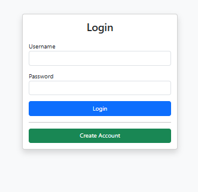
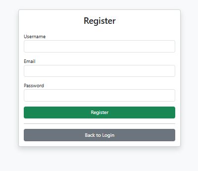
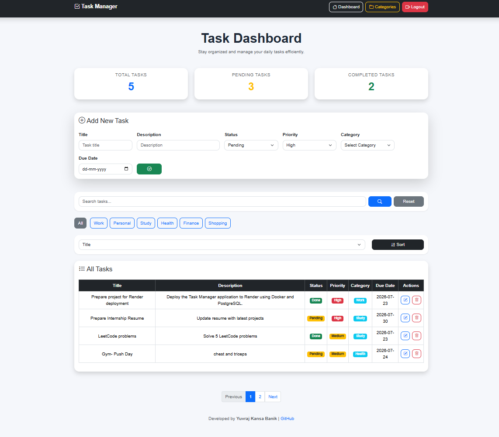
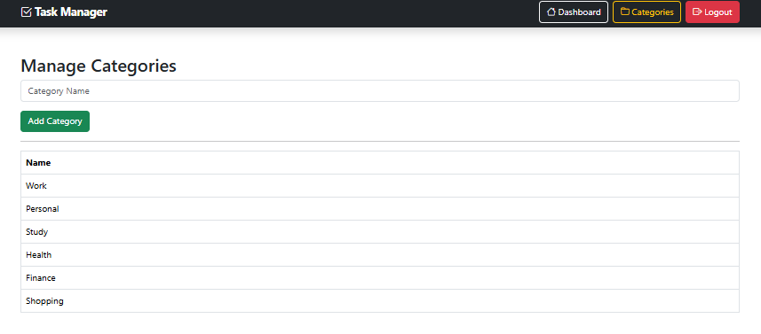

# Task Manager

A full-stack Task Management web application built with **Spring Boot**, **Spring Security**, **Thymeleaf**, and **PostgreSQL**. The application allows users to securely manage their daily tasks through authentication, CRUD operations, and cloud-based data persistence.

---

## Live Demo [Click on link]

🔗 **Application:** https://task-manager-00hu.onrender.com

---

## Features

- Secure user authentication with Spring Security
- Create, update, and delete tasks
- View all tasks in a responsive dashboard
- Task priority and status management
- Server-side form validation
- PostgreSQL database integration
- Dockerized deployment
- Hosted on Render

---

## Tech Stack

| Category | Technologies |
|----------|--------------|
| Language | Java 21 |
| Backend | Spring Boot, Spring MVC |
| Security | Spring Security |
| Database | PostgreSQL (Neon) |
| ORM | Spring Data JPA, Hibernate |
| Frontend | Thymeleaf, HTML, CSS |
| Build Tool | Maven |
| Deployment | Docker, Render |
| Version Control | Git & GitHub |

---

## Screenshots

### Login



---
### Register




### Dashboard



---

### Categories



---

## Project Structure

```text
src
├── controller
├── service
├── repository
├── entity
├── config
├── templates
├── static
└── resources
```

---

## Getting Started Locally

### Clone the repository

```bash
git clone https://github.com/YuvrajKbanik/springboot-task-manager.git
```

### Navigate to the project

```bash
cd springboot-task-manager
```

### Configure environment variables

```
SPRING_DATASOURCE_URL
SPRING_DATASOURCE_USERNAME
SPRING_DATASOURCE_PASSWORD
```

### Run the application

```bash
./mvnw spring-boot:run
```

The application will be available at:

```
http://localhost:8080
```

---

## Author

**Yuvraj Kansa Banik**

- GitHub: https://github.com/YuvrajKbanik
- LinkedIn: https://www.linkedin.com/in/yuvraj-kansa-banik-936b58326/

---

## License

This project is licensed under the MIT License.