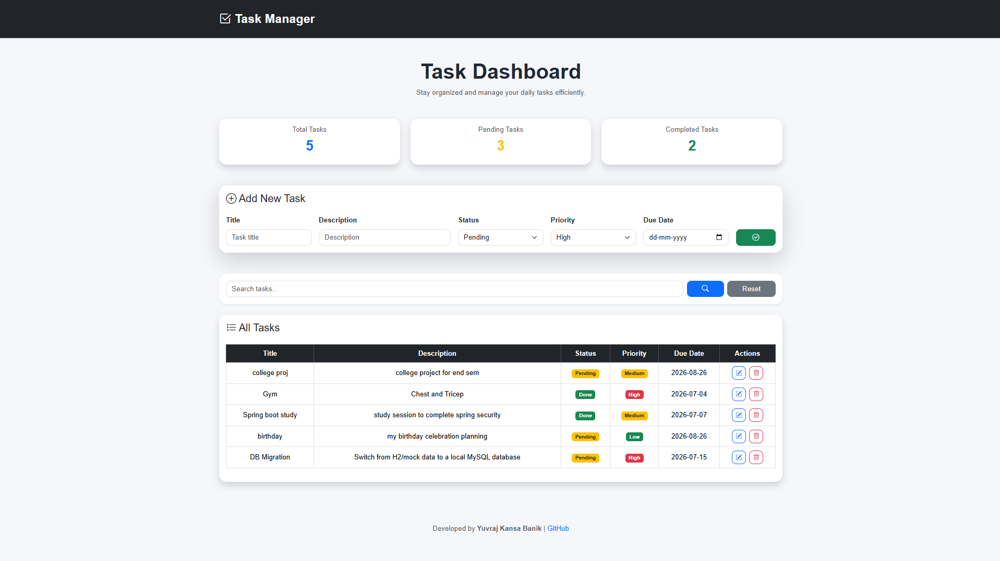

# Spring Boot Task Manager

A task management web application built using Spring Boot, Spring Data JPA, Thymeleaf, and MySQL. It allows users to create, update, delete, and manage tasks through a responsive web interface.

## Features

- Create, update, and delete tasks
- View all tasks
- Task status management
- Due date support
- Responsive Bootstrap UI

## Technologies

- Java
- Spring Boot
- Spring Data JPA
- Thymeleaf
- MySQL
- Bootstrap 5
- Maven

## Screenshot

## Run Locally

1. Clone the repository.
2. Configure MySQL in `application.properties`.
3. Run `StoreApplication.java`.
4. Open `http://localhost:8080/tasks`.

## Author

Yuvraj Kansa Banik

GitHub: https://github.com/YuvrajKbanik